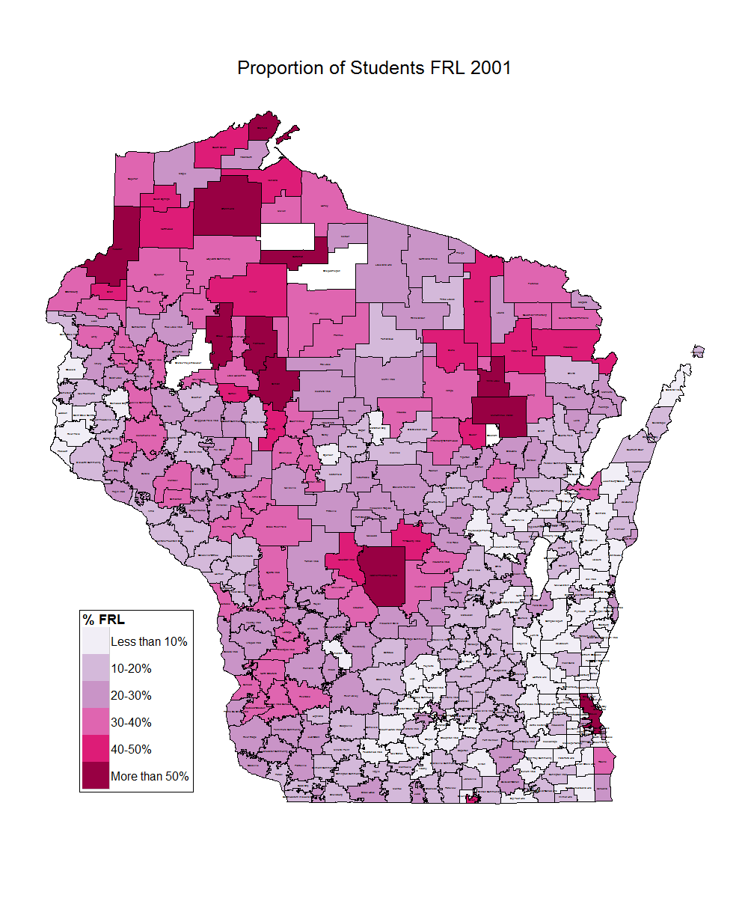

```{r knitrsetup,echo=FALSE,eval=TRUE,results="hide",error=FALSE,message=FALSE,warning=FALSE}
library(knitr)
opts_chunk$set(fig.width=8,fig.height=5.5,message=FALSE,error=FALSE,warning=FALSE,echo=TRUE,dev=c("svg"),comment=NA,out.width="750px",out.height="550px", fig.align='center')
library(eeptools)
library(ggplot2)
library(ggthemes)
#require('hexbin')
#load("data/cache.rda")
```

## The First Directive {.build}

> Know thy data, but know thy audience better. 

- What is their question?
- What is their timeframe?
- What are their constraints?
- What is their capacity?

## The Struggle


## Yabbut - too much data {.flexbox .vcenter}


## Yabbut - too many priorities {.flexbox .vcenter}


## The Way Out {.build}

  1. Identify your goals 
  
  2. Explore your data and focus
  
  3. Focus even narrower
  
  4. Find the context
  
  5. Put it together


## What do you want to say? {.flexbox .vcenter}



## Model fit {.flexbox .vcenter}


## Of Metrics and Dashboards

Widgets provide limited utility.


## Identify your goals

What is the goal of this graphic? 


## What did we learn?

- The words `obviously` and `education` were used a lot
- Some other words were frequent too
- **what value have we provided?** 

## Goals need not mean complex graphics

```{r echo=FALSE, warning=FALSE, message=FALSE}
data(mtcars)
qplot(hp, qsec, data=mtcars, geom="point") + theme_dpi() + 
  geom_smooth()+  labs(x="Horsepower", y="Quart. Mile Time", 
                       title="Horsepower and Speed for My Cars") + 
  annotate(x = 320, y = 15.7, label ="Maserati", geom = "text") +
  annotate(x = 260, y = 14, label ="Duster 360", geom = "text") +
  annotate(x = 110, y = 22.4, label = "Merc 230", geom = "text") + 
  geom_vline(xintercept = 220, linetype = 2) + 
  geom_hline(yintercept = 16, linetype = 2)
```

## What do we learn?

- More power = faster times
- Clear outliers are identified to enable discussion
- Reference lines are provided to give audience orientation
- A smoother is applied to show the general trend

```{r echo=FALSE, warning=FALSE, message=FALSE, fig.width = 4, fig.height=2.75}
data(mtcars)
qplot(hp, qsec, data=mtcars, geom="point") + theme_dpi() + 
  geom_smooth()+  labs(x="Horsepower", y="Quart. Mile Time", 
                       title="Horsepower and Speed for My Cars") + 
  annotate(x = 320, y = 15.7, label ="Maserati", geom = "text") +
  annotate(x = 260, y = 14, label ="Duster 360", geom = "text") +
  annotate(x = 110, y = 22.4, label = "Merc 230", geom = "text") + 
  geom_vline(xintercept = 220, linetype = 2) + 
  geom_hline(yintercept = 16, linetype = 2)
```

## Quote

<p><q> How you turn dimensions in the <span class = 'red'>data</span> into visual 
cues for your audience is everything.</q></p>


## Balance is hard

Raw Data

:   Plot the data as is - easy to explain, does not scale

Summarize

:   Calculate statistics on the data and plot, meaningful, may obscure important detail

Model

:   Model the data, analysis of specific questions is clear, harder to explain
    
## Test

Term: Raw data 
- Plot the points as is
- Pros: easy to explain and interpret
- Cons: does not scale well, insights not obvious

Term: Summarize
- Summarize the data and plot summaries
- Pros: Meaningful summaries are efficient
- Cons: More complex, summaries may skew important features

Term: Model 
- Model the data and show simulations or projections
- Pros: Forces analysis to answer questions
- Cons: Complex, difficult to convey results

## How do we choose? 

Identify our goals and make a lot of graphs.

## Exploratory vs. Explanatory

Exploratory graphics are what we use to understand the data. They are useful 
for us to understand what is going on and where the key features of a 
dataset are. 

Explanatory graphics are polished and annotated graphics that provide the 
viewer with information. Sometimes they are self-contained. 

## Exploratory


## Explanatory


## Exploratory


## Summary


## Models


## Don't Underestimate Your Audience

- 1 polished detailed graph is better than 10 throwaway graphs
- Provide context and remember your limits
- Link your graphic to things leadership cares about

## Context as Key

- Education graphics are littered with plots without context
- Context is what creates urgency, helps focus decision making, and 
allows tradeoffs to be balanced

## Attendance example

```{r}
attendsummary <- data.frame(year = 2008:2013, 
                            att = c(97.7, 93.5, 92.6, 96.2, 96.4, 96.7), 
                            sd = c(0.8, 1.2, 0.9, 0.95, 0.96, 1.2), 
                            count = c(500, 460, 480, 490, 492, 460))
qplot(factor(year), att, data = attendsummary, geom = 'bar', stat = 'identity') + 
  labs(x = "Year", y = "Att. Rate", title = "Attendance Rate in School Over Time") + 
  theme_dpi()

```

## Iterate

```{r}

qplot(factor(year), att, data = attendsummary, geom = 'bar', stat = 'identity', 
      color = I("gray30"), fill = I("gray80")) + 
  labs(x = "Year", y = "Att. Rate", title = "Attendance Rate in School Over Time") + 
  theme_dpi() + geom_hline(yintercept = 95, linetype = 2, color = I("red"))

```

## Not bad 

```{r}
ggplot(attendsummary, aes(x = year, y = att, ymin = att - 1.8*sd, 
                          ymax = att + 1.8*sd)) + 
  geom_bar(stat = "identity", color = I("gray30"), fill = I("gray80")) +
  geom_errorbar(width =0.4, color = I("red")) + ylim(c(0, 100)) + 
  geom_hline(yintercept = 95, linetype = 2, color = I("red"))

```

## Context

- Moves the conversation forward 
- Focuses us on the issue at hand
- Reduces complexity without throwing away data

## Simulation

## Counterfactual Modeling

## Talk Outline

* Problem Statement
  - Lots of data, lots of demand
  - Limited time, space, and opportunity
* Role of Leadership
  - Be strategic in what you present
  - Lead your audience -- analysis, not data
* Tools
  - Context
  - Counterfactuals
  - Simulation
* Practical

## Slide with R Code and Output | A subtitle

<div class="red2">
This text is red
</div>

```{r}
summary(cars)
```

## Slide with Plot

```{r, echo=FALSE}
plot(cars)
```

## A Simple Table

 Right     Left     Center     Default
-------     ------ ----------   -------
     12     12        12            12
    123     123       123          123
      1     1          1             1

Table:  Demonstration of simple table syntax.

## A multiline table

-------------------------------------------------------------
 Centered   Default           Right Left
  Header    Aligned         Aligned Aligned
----------- ------- --------------- -------------------------
   First    row                12.0 Example of a row that
                                    spans multiple lines.

  Second    row                 5.0 Here's another one. Note
                                    the blank line between
                                    rows.
-------------------------------------------------------------

Table: Here's the caption. It, too, may span
multiple lines.


## R Markdown
Opinions about data visualization are everywhere and quick search online reveals thousands of resources to learn how to draw bar graphs and when a scatter plot might be effective. While getting the technical details right is important, it is merely a necessary, but not sufficient, condition for driving change. In order to effectively use data in a decision making context, analysts must focus on knowing their audience, knowing the decision space, and leading their audience toward constructive engagement with the data. Using examples from senior leadership discussions at the Wisconsin Department of Public Instruction, this talk will explore how to build capacity in an audience and empower them to make decisions informed by analytics. A particular focus will be taken on the deliberate design choices an analyst must confront in order construct visualizations that are accessible and invite discussion. This includes strategies such as simulation, counterfactual modeling, and selection of context cues to bring the data into a familiar frame for the audience. The session will conclude with a brief discussion of practical advice on technologies, formats, and presentation techniques for different audience types.


## Asset {.vcenter}
```{r fig.width=7, fig.height=6.5, fig.cap = "EWS Model Fit Plots", fig.align='center'}
library(png)
library(grid)
img <- readPNG("assets/ewsLITplot.png")
grid.raster(img)
```

