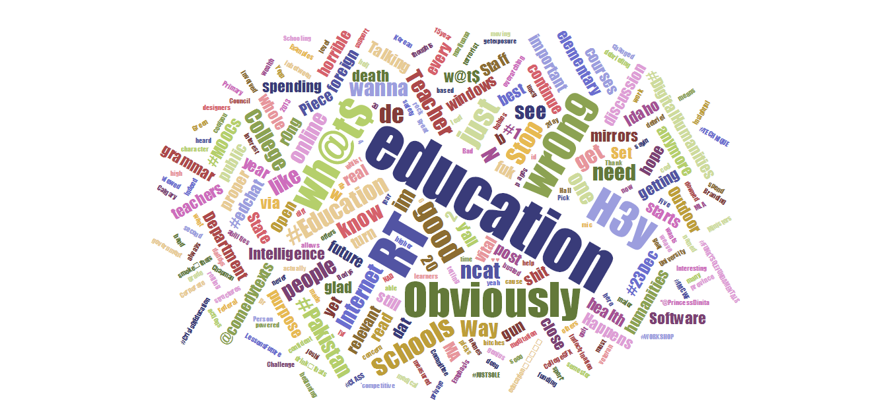

```{r knitrsetup,echo=FALSE,eval=TRUE,results="hide",error=FALSE,message=FALSE,warning=FALSE}
library(knitr)
opts_chunk$set(fig.width=8,fig.height=5.5,message=FALSE,error=FALSE,warning=FALSE,echo=FALSE,dev=c("png"),comment=NA,out.width="750px",out.height="525px", fig.align='center')
library(eeptools)
library(ggplot2)
library(png); library(jpeg)
library(grid)
```

## Outline

- This talk will focus on 5 graphics as an illustration of the principals of 
policy focused data visualization
- Each example is taken from real policy discussions with senior leadership in 
a state education agency
- Together, these examples demonstrate how data visualization can be used to 
inform policy and decision making
- But first...

## The Principles {.build}

> Know thy data, and know thy audience better. 

<br>
<br>

> - What is their *question*?
> - What is their *timeframe*?
> - What are their **constraints**?
> - What is their **capacity**?


## On Audience

> Your audience can understand much more than you may think. It is all in how 
you lead them there. 

## The Barriers

- Time
- Data
- Tools
- Tech

## Yabbut - too much data 

```{r fig.cap = "Data is Everywhere", fig.align='center'}
img <- readJPEG("assets/data.jpg")
grid.raster(img, interpolate = TRUE)
```


## Yabbut - too many priorities


## Unclear direction

```{r fig.cap = "Data is Everywhere", fig.align='center'}
img <- readJPEG("assets/traffic.jpg")
grid.raster(img, interpolate = TRUE)
```

## The Way Out 

1. Identify your goals (strategy)
2. Explore your data and focus (analysis)
3. Focus even narrower (leadership)
4. Find the context (context)
5. Put it together (presentation)
<br>
<br>

Use the data to make a visualization that presents an argument supported by evidence. 

## Strategy: What can this data say? 


## Of Metrics and Dashboards

Widgets provide limited connection to strategy.

```{r fig.cap = "Infographic, or confusion?", fig.align='center'}
img <- readPNG("assets/badinfographic.png")
grid.raster(img, interpolate = TRUE)
```

## Analyze your data to find the meaning

What is the goal of this graphic? 



## What did we learn?

> - The words *obviously* and *education* were used a lot
> - Some other words were frequent too
> - **What value have we provided?** 

## Exploratory vs. Explanatory

*Exploratory graphics* are what we use to understand the data. They are useful 
for us to understand what is going on and the key features of a dataset

<br>
<br>

*Explanatory graphics* are polished and annotated graphics that convey a fact or 
argument

## Exploratory

```{r fig.cap = "Exploring Group Differences", fig.align='center'}
img <- readPNG("assets/cumlDENSmega91.png")
grid.raster(img, interpolate = TRUE)
```

## Explanatory

```{r fig.cap = "Cumulative Assessment Density", fig.align='center'}
img <- readPNG("assets/cumlDENS97.png")
grid.raster(img, interpolate = TRUE)
```

## What have we learned?

- Strong link between ACT and WKCE scores
- Not only does the mode shift with WKCE percentile, but the variation shifts as well
- Low WKCE scores mean a low chance at meeting the ACT benchmark

## An aside on complexity

- Yes, these graphics are more complex
- Explaining one complex graphic to the audience with a strong meaning is powerful
- Many superficial graphics have a harder time conveying a strong message

## Leadership means making the point clear


## What did we learn?

- Student mobility across proficiency categories is hard
- Student growth is parallel across percentiles
- Students regress as well as grow
- Assessment measures can be noisy

## Context
 
```{r fig.cap = "Showing Models", fig.align='center'}
img <- readPNG("assets/ewsLITplot.png")
grid.raster(img, interpolate = TRUE)
```

## Context as Key

- Education graphics are littered with plots without context
- Context is what creates urgency, helps focus decision making, and 
allows tradeoffs to be balanced
- Moves the conversation forward 
- Focuses us on the issue at hand
- Reduces complexity without throwing away data

## Don't Underestimate Your Audience

- 1 polished detailed graph is better than 10 throwaway graphs
- Provide context and remember your limits
- Link your graphic to things leadership cares about


## Some Solutions

```{r fig.cap = "Technology Choices in Viz", fig.align='center'}
img <- readPNG("assets/technologies.png")
grid.raster(img, interpolate = TRUE)
```


## Simulation

```{r fig.cap = "Density", fig.align='center'}
img <- readPNG("assets/HighMathGapClose.png")
grid.raster(img, interpolate = TRUE)
```

## Counterfactual Modeling

```{r fig.cap = "Density", fig.align='center'}
img <- readPNG("assets/racegapgradFORAPRIL2014.png")
grid.raster(img, interpolate = TRUE)
```


## Thank You and Contact Info

- DEWS Homepage: [http://wise.dpi.wi.gov/wisedash_dews](http://wise.dpi.wi.gov/wisedash_dews)
- E-mail: jared.knowles@dpi.wi.gov / jknowles@gmail.com
- GitHub: [http://www.github.com/jknowles](http://www.github.com/jknowles)
- Homepage: [www.jaredknowles.com](http://www.jaredknowles.com/)
- Google+: [https://plus.google.com/+JaredKnowles](https://plus.google.com/+JaredKnowles)

<br>
<br>

<p align="center"></p>
